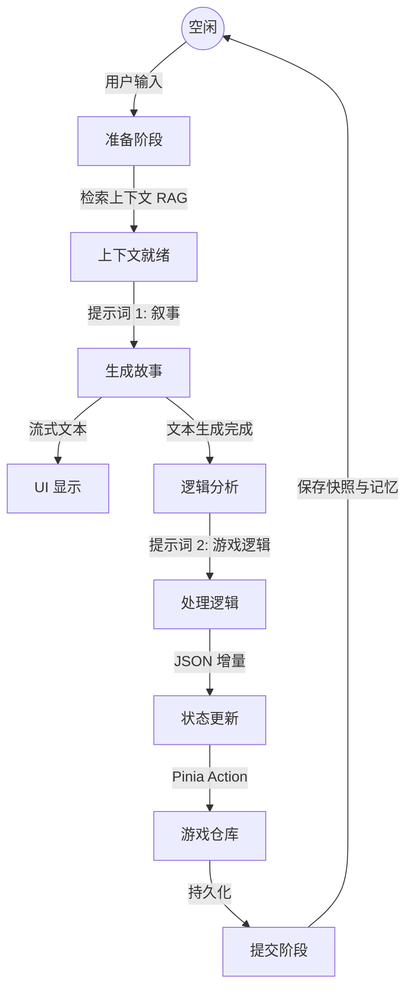

# 技术设计文档 - 东方异界食堂 (Touhou Isekai Izakaya)

## 1. 项目概述
“东方异界食堂”是一款基于浏览器的 AI 原生角色扮演游戏 (RPG)。利用 LLM 生成动态叙事和游戏逻辑。架构设计旨在实现完全在浏览器环境运行的**持久化**、**状态一致性**和**复杂上下文管理**。

## 2. 技术栈

- **前端框架**: Vue 3 (Composition API) + Vite 7
- **状态管理**: Pinia (响应式内存状态)
- **数据库**: SQLite Wasm (官方构建版) + OPFS (源私有文件系统)
- **开发语言**: TypeScript
- **样式方案**: TailwindCSS
- **并发处理**: Web Workers (用于数据库操作，避免阻塞主线程)

## 3. 核心架构

应用采用以 `GameLoopService` 为核心的**流水线驱动架构 (Pipeline-Driven Architecture)**。

### 3.1. “三模型”流水线
为了确保稳定性和结构化，游戏将职责拆分为三个截然不同的角色，而不是单一的 LLM 调用：

1.  **叙事 (Storyteller)**:
    -   **职责**: 生成沉浸式的角色扮演文本、对话和环境描写。
    -   **输入**: 当前状态、用户行动、相关记忆。
    -   **输出**: 自然语言文本（流式传输至 UI）。
    -   **源码参考**: [gameLoop.ts](file:///c%3A/Users/Administrator/Desktop/Touhou%20Isekai%20Izakaya/src/services/gameLoop.ts) -> `llmService.chatStream`

2.  **逻辑引擎 (Game Master)**:
    -   **职责**: 分析叙事和用户意图，更新游戏状态。
    -   **输入**: 用户行动 + 生成的叙事内容。
    -   **输出**: 严格的 JSON 格式状态增量（例如：`hp -10`, `money +500`, `add_item: "红茶"`）。
    -   **源码参考**: [logic.ts](file:///c%3A/Users/Administrator/Desktop/Touhou%20Isekai%20Izakaya/src/services/logic.ts)

3.  **记忆引擎 (Scribe)**:
    -   **职责**: 将本回合发生的事件压缩为简短的“记忆”，构建记忆关联图谱。
    -   **输入**: 用户行动 + 叙事内容 + 状态变更。
    -   **输出**: 结构化的记忆条目（摘要、实体、标签、重要度）及其在图谱中的关联。
    -   **源码参考**: [memory.ts](file:///c%3A/Users/Administrator/Desktop/Touhou%20Isekai%20Izakaya/src/services/memory.ts)

### 3.2. 游戏循环流程 (`src/services/gameLoop.ts`)

## 4. 状态管理与持久化

### 4.1. 双层状态架构
1.  **运行时状态 (Pinia)**:
    -   `GameStore`: 保存活跃的游戏状态（玩家属性、物品栏、NPC 关系、世界标记）。
    -   `ChatStore`: 管理 UI 对话历史和虚拟化加载（分页）。
    -   **单一事实来源**: Pinia store 是当前回合的权威状态。

2.  **持久化状态 (SQLite + OPFS)**:
    -   **为何选择 SQLite?**: `IndexedDB` (及 Dexie 等封装) 在处理大型 JSON 块和复杂查询（如全文搜索）时性能较差。SQLite Wasm 通过 OPFS 提供了强大的 SQL 能力和稳健的文件存储。
    -   **快照 (Snapshots)**: 每次 LLM 响应都会触发状态快照。这允许通过将之前的快照重新加载到 Pinia store 来实现“时间旅行”（回滚）。

### 4.2. 数据库模式 (`src/worker/schema.ts`)

| 数据表 | 描述 | 核心列 |
| :--- | :--- | :--- |
| `saves` | 存档位元数据 | `id`, `name`, `lastPlayed`, `location` |
| `chats` | 对话历史 | `id`, `saveSlotId`, `role`, `content`, `timestamp`, `snapshotId` |
| `snapshots` | 完整状态转储 | `id`, `saveSlotId`, `turnCount`, `gameState` (JSON), `chatId` |
| `memories` | 长期知识 (RAG) | `id`, `saveSlotId`, `content`, `tags`, `related_entities`, `importance` |
| `memory_relations` | 记忆关联图谱 | `source_id`, `target_id`, `rel_type`, `strength` |

*注：`memories` 表支持 FTS5 全文搜索，用于高效检索。*

## 5. 关键模块实现

### 5.1. 数据库服务 (DAL)
-   **位置**: [DatabaseService.ts](file:///c%3A/Users/Administrator/Desktop/Touhou%20Isekai%20Izakaya/src/services/DatabaseService.ts)
-   **模式**: Web Worker 的异步代理。
-   **机制**: 使用类似 `Comlink` 的消息传递机制（请求/响应 ID）与 `db.worker.ts` 通信。
-   **特性**:
    -   `addChatMessage`: 对话与快照的事务性插入。
    -   `searchMemories`: 针对 RAG 上下文的 FTS 查询。
    -   `importSave`: 用于迁移的批量处理。

### 5.2. 逻辑处理器
-   **位置**: [logic.ts](file:///c%3A/Users/Administrator/Desktop/Touhou%20Isekai%20Izakaya/src/services/logic.ts)
-   **验证**: 强制执行数值规则（例如：“HP 不能超过 MaxHP”，“金钱不能为负”）。
-   **映射**: 将模糊的 LLM 输出（如“她生气了”）映射为具体的数值变更（`favorability -5`）。

### 5.3. 记忆系统 (星型+链式图谱 RAG)
-   **位置**: [memory.ts](file:///c%3A/Users/Administrator/Desktop/Touhou%20Isekai%20Izakaya/src/services/memory.ts)
-   **图谱结构**: 
    -   **链式 (Sequence)**: 记忆按时间顺序连接，形成叙事主轴。
    -   **星型 (Entity Star)**: 围绕相同实体（NPC、地点、物品）建立关联，形成语义网络。
-   **提取**: 每回合结束后，提取结构化信息并根据实体重合度自动建立图谱连接。
-   **检索 (PEDSA 算法)**:
    1.  **关键词检索**: 利用 SQLite FTS 寻找初步匹配的“种子”记忆。
    2.  **能量扩散 (Spreading Activation)**: 种子记忆获得初始能量，沿图谱边向邻近节点扩散。
    3.  **衰减与修剪**: 能量随跳数衰减（Decay），低于阈值的节点停止扩散，最终召回高能量的相关记忆，即使其不含当前关键词。
-   **图谱服务**: [MemoryGraphService.ts](file:///c%3A/Users/Administrator/Desktop/Touhou%20Isekai%20Izakaya/src/services/MemoryGraphService.ts) 实现内存级图谱缓存与并行激活。

## 6. 迁移策略
-   **旧版**: Dexie (IndexedDB)。
-   **新版**: SQLite Wasm (OPFS)。
-   **流程**:
    1.  用户触发迁移。
    2.  `src/services/migration.ts` 读取所有 Dexie 数据。
    3.  数据分块（避免内存溢出）并发送至 Worker。
    4.  Worker 执行 `BEGIN TRANSACTION` -> 批量插入 -> `COMMIT`。
    5.  迁移成功后，归档/清理 Dexie 数据库。

## 7. 未来展望
-   **高级语义关联**: 目前已实现基于图谱的能量扩散检索（PEDSA）。未来可进一步集成轻量级向量模型（Wasm），实现向量搜索与图谱关联的混合检索。
-   **语音/TTS**: `GameLoop` 中已预留集成点，用于在文本流式传输后生成语音。
-   **多代理协作**: 引入专门的角色驱动代理，处理更复杂的 NPC 背景与长期动机。
